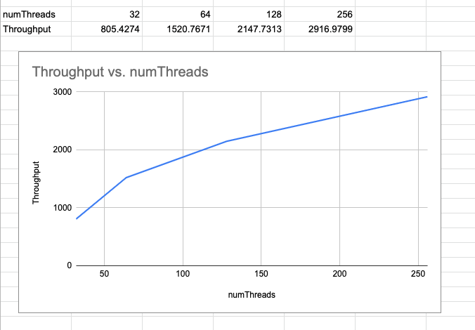
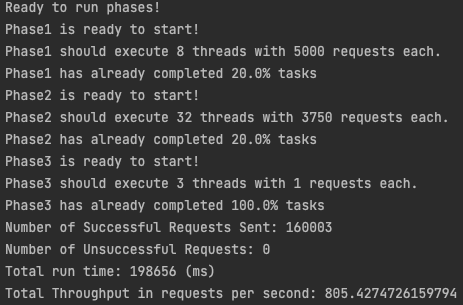
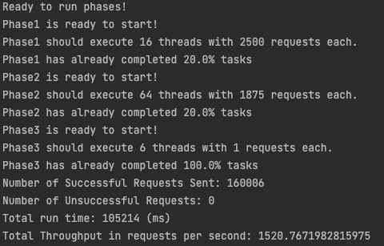
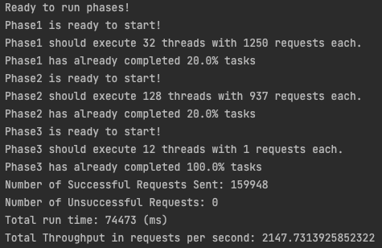
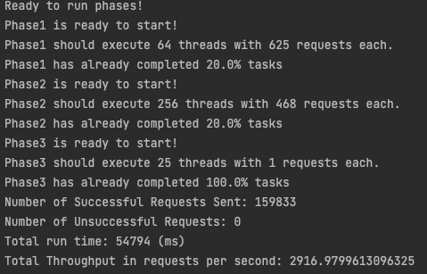
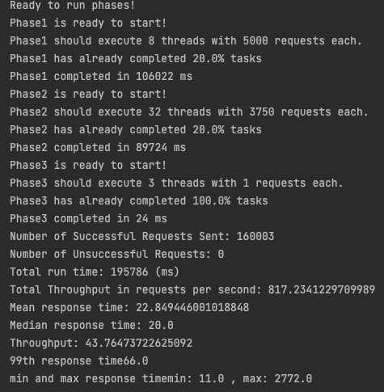
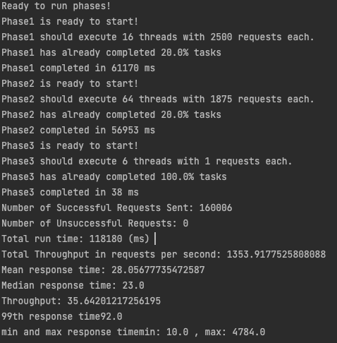
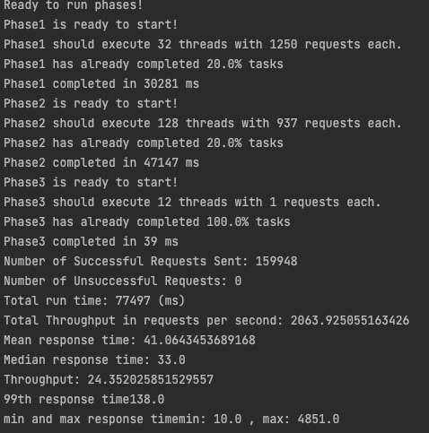

# Report for Homework1 of CS6650

## GitHub Repo

https://github.com/zjdx1998/CS6650/tree/Homework1/Assignment1

## Server

I implemented a full-completed server which can handle every request and return response as https://app.swaggerhub.com/apis/cloud-perf/SkiDataAPI/1.16#/skiers/getSkierResortTotals expected.

## Client 1

### Design

Client1 is consist of three parts:

The first part is global arguments processing, where I utilized `args4j` to parse the arguments. I also stored the global variables like `successCount`, `failureCount` which represents the total number of successful and failed requests.

The second part is a runnable class `PhaseThread`, which accepts `int startID, int endID, int startTime, int endTime, int numOfReqs, CountDownLatch latch` as parameter

## Clients 2

