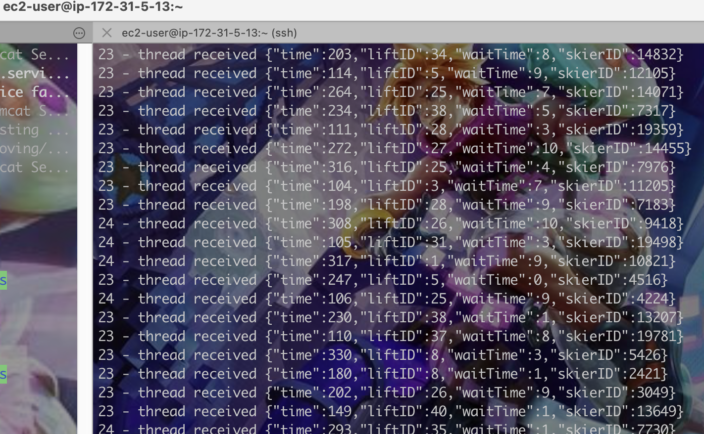
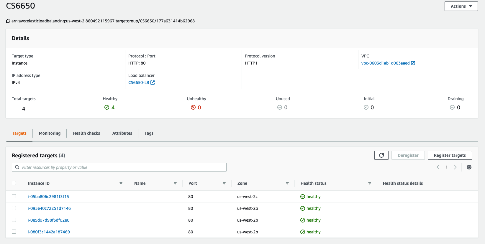
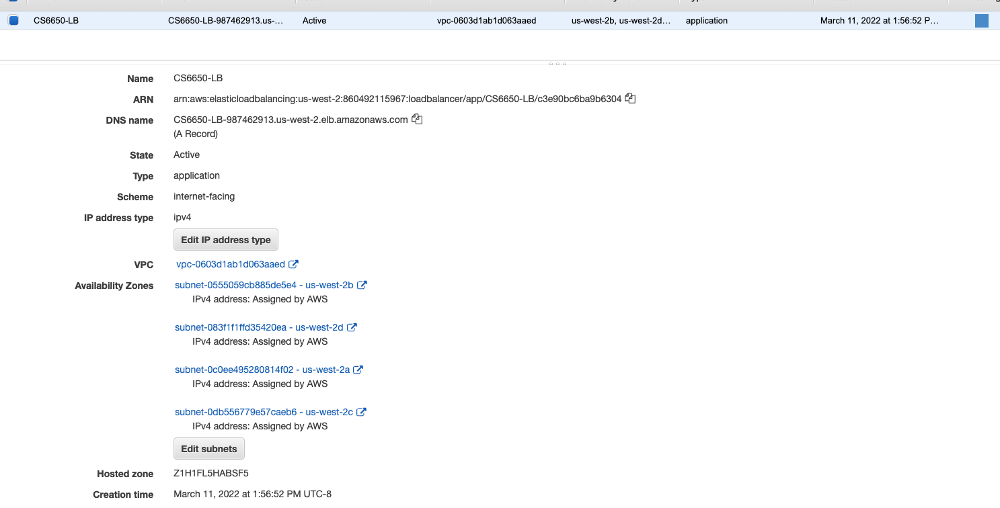
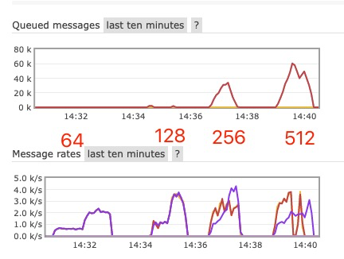

## CS6650 Assignment2 Report

## URL to Repo

Please visit [Github Repository](https://github.com/zjdx1998/CS6650/tree/Homework2).

## Design

### Server


I adopts the server desgin from previous project, except adding a `BlockingQueue` to store the channels. Each time a channel is taken from the queue, a new channel will be added in to the queue.

Since we only test the `POST /skiers/{resortID}/seasons/{seasonID}/days/{dayID}/skiers/{skierID}` from https://app.swaggerhub.com/apis/cloud-perf/SkiDataAPI/1.16#/ , the main changes happen in `SkiersServlet` class.

In this class, I firstly use `ConnectionFactory` to build a connection with my rabbitmq which is located at `ec2-54-203-208-182.us-west-2.compute.amazonaws.com`. Since I have the private ipv4 address of this ec2 instance, I configured all needed information in `rabbitmy.conf` inside resource folder like this:

```bash
172.31.5.13
5672
admin
fuckjava
```

Once a skier post is received by Server, the configuration file will be automatically loaded and connect to Rabbitmq. Each post will be handled in `doPost` function.  The primary function is listed below.

```java
channel = channelPool.take();
channel.basicPublish("", Constant.QUEUE_NAME, null, msg.toString().getBytes());
res.setStatus(HttpServletResponse.SC_CREATED);
System.out.println("Sent " + msg + " to rabbitmq");
res.getWriter().write("Sent " + msg + " to rabbitmq");
channelPool.add(channel);
```

### Others

For detailed design, please see the codes. 

For your convinence, I build a docker image based on the [Dockerfile](Consumer/Dockerfile) . You can also `docker pull zjdx1998/consumer:mar11-amd64-latest` then `docker run -it --rm --name consumer zjdx1998/consumer:mar11-amd64-latest` to start the consumer service.

Or you can build manually to get a consumer run in the local environment.

Here is a output window for remote Consumer.



For Clients, there is no change since last project. But the parameter should be changed from single instance public url to load balancing url.

`java Client -nt 128 -ns 20000 -nl 40 -nr 10 -server CS6650-LB-987462913.us-west-2.elb.amazonaws.com ec2-54-149-212-65.us-west-2.compute.amazonaws.com localhost:8080/Server_war `


Load Balancing:





## Results Analysis

## Do we really need load balancing?

64-20000 Without Load Balancing

<center class='half'>
  
  
</center>


Here is the result of `numThreads=64 numSkiers=20000` with two instances Load Balanced.

<center class='half'>
  
  
</center>

From the chart we know all throughput, total run time, message rates have a significant improvement. 

The improvement percentage for each parameter is


$$
P_{throughput} = \frac{1277.33}{883.99} = 1.445 \\
P_{totalRunTime} = \frac{122976}{178026} = 0.6907\\
P_{messageRates} = \frac{2.4k/s}{1.6k/s} = 1.5
$$


So we can get the conclusion that we need load balancing!


Here is a result for `numThreads=64, 128, 256 and 512` with 4 instances load balanced.

And the parameter for consumer is `numChannel = 10, basicQos = 0`.




<center class='half'>
  
  
</center>

<center class='half'>
  
  
</center>


### Some analysis on number of threads of consumer

Below are two images with `numThreads=128 & numSkiers=20000 & numChannel = 100 & basicQos = 10 and numThreads=128 & numSkiers=20000 & numChannel = 100 & basicQos = 100`.

<center class='half'>
  
  
</center>

From which we can see the queued messages for the one with larger `basicQos` is noticeably smaller than the former. 

But if we enlarge the `basicQos` until it become 0, the number of queued message is getting smaller then larger. That's an interesting thing.

