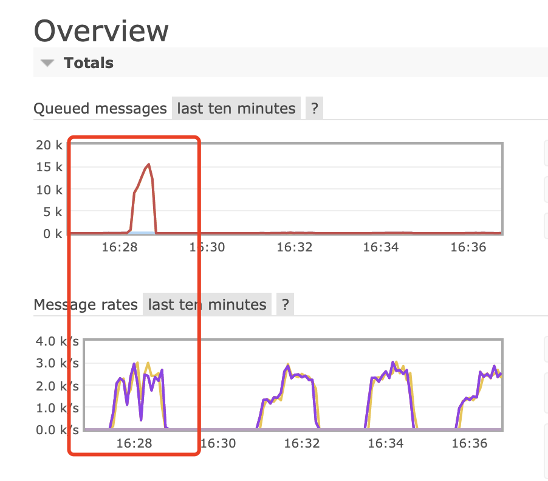
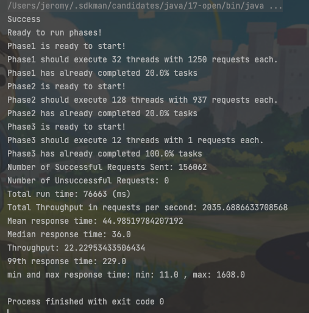

# Report for Assignment3

## Git Repo

Please visit [Github Repo](https://github.com/zjdx1998/CS6650/tree/Homework3)

## Design

* Database Design

  * For Skier Microservice, the database stored data by `key = skierID, value={seasonID, dayID, vertical=liftID*10, liftID}`.
  * For Resort Microservice, the database stored data by `key = day+dayID, value = {seasonID, resortID, skierID, liftID, time}`.

* Deployment on AWS

  * Server

    * Build artifacts of Server, then scp into server's tomcat webapp folder.

  * Client

    * Same as [Assignment2](https://github.com/zjdx1998/CS6650/tree/Homework2).

  * Consumer

    * Switch into Consumer folder, run `zsh(or bash) build.sh` which will build the current image and push that into `zjdx1998/consumer` with latest tag.

    * For your convenience, run

      ```bash
      docker pull zjdx1998/consumer:mar11-amd64-latest
      docker run -it --rm --network="host" --name consumer zjdx1998/consumer:mar11-amd64-latest localhost skier
      ```

      to start skier micro service.

      And run

      ```
      docker pull zjdx1998/consumer:mar11-amd64-latest
      docker run -it --rm --network="host" --name consumer zjdx1998/consumer:mar11-amd64-latest localhost resort
      ```

      to start resort micro service.

      Here is a screenshot of skier microservice running in aws ec2.


## Test Runs

### Step1

For 128 threads, the client arguments are: `-nt 128 -ns 20000 -nl 40 -nr 10 -server PUBLIC_IP_ADDRESS`

Start the microservice by `docker run -it --rm --network="host" --name consumer zjdx1998/consumer:mar11-amd64-latest localhost skier`.

<center>
  
  
</center>

For 256 threads, the client arguments are: `-nt 256 -ns 20000 -nl 40 -nr 10 -server PUBLIC_IP_ADDRESS`

Start the microservice by `docker run -it --rm --network="host" --name consumer zjdx1998/consumer:mar11-amd64-latest localhost skier`.

<center>
  
  
</center>

### Step2

For 128 threads, the client arguments are: `-nt 128 -ns 20000 -nl 40 -nr 10 -server PUBLIC_IP_ADDRESS`

Start the microservice by `docker run -it --rm --network="host" --name consumer zjdx1998/consumer:mar11-amd64-latest localhost resort`.

<center>
  
  
</center>

For 256 threads, the client arguments are: `-nt 256 -ns 20000 -nl 40 -nr 10 -server PUBLIC_IP_ADDRESS`

Start the microservice by `docker run -it --rm --network="host" --name consumer zjdx1998/consumer:mar11-amd64-latest localhost resort`.

<center>
  
  
</center>

### Step Combined

For 128 threads, the client arguments are: `-nt 128 -ns 20000 -nl 40 -nr 10 -server PUBLIC_IP_ADDRESS`

Start the microservice by `docker run -it --rm --network="host" --name consumer1 zjdx1998/consumer:mar11-amd64-latest localhost resort && docker run -it --rm --network="host" --name consumer2 zjdx1998/consumer:mar11-amd64-latest localhost skier `.

<center>
  
  
</center>

For 256 threads, the client arguments are: `-nt 256 -ns 20000 -nl 40 -nr 10 -server PUBLIC_IP_ADDRESS`

Start the microservice by `docker run -it --rm --network="host" --name consumer1 zjdx1998/consumer:mar11-amd64-latest localhost resort && docker run -it --rm --network="host" --name consumer2 zjdx1998/consumer:mar11-amd64-latest localhost skier `.

<center>
  
  
</center>


## Mitigation Strategy

I believe it's totally okay if we don't use any mitigation strategy because the number of queued messages is less than 100 which is quite small.

But I still deploy the `EventCountCircuitBreaker` into Server.

The Server use `breaker = new EventCountCircuitBreaker(500, 5, TimeUnit.SECONDS, 300);` which means check every 5 seconds to see if the current requests are more than 500 and stop processing requests(i.e. send to rabbitmq) if so, and resume processing when the request per 5 seconds is smaller than 300.

From the below chart, we can see a relatively noticeably improvement on queued messages for 256 client threads. 


Meanwhile, I reused the load balancer from last assignment, and the results are:


That's a huge improvement compared to the previous one. But the network stability issues should also be considered into the factors.


Thanks for your reading!