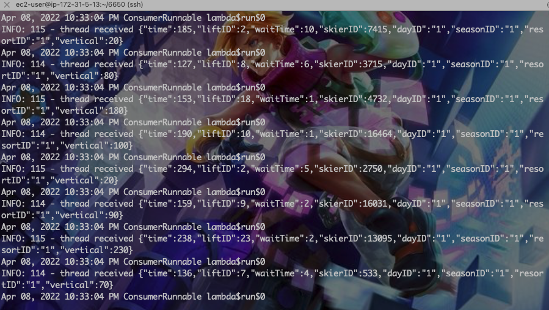

# Report for Assignment4

## Git Repo

Please visit [Github Repo](https://github.com/zjdx1998/CS6650/tree/Homework3)

## Design

* Database Design

  * For Skier Microservice, the database stored data by `key = skierID, value={seasonID, dayID, vertical=liftID*10, liftID}`.
  * For Resort Microservice, the database stored data by `key = day+dayID, value = {seasonID, resortID, skierID, liftID, time}`.

* Deployment on AWS

  * Server

    * Build artifacts of Server, then scp into server's tomcat webapp folder.

  * Client

    * Same as [Assignment2](https://github.com/zjdx1998/CS6650/tree/Homework2).

  * Consumer

    * Switch into Consumer folder, run `zsh(or bash) build.sh` which will build the current image and push that into `zjdx1998/consumer` with latest tag.

    * For your convenience, run

      ```bash
      docker pull zjdx1998/consumer:mar11-amd64-latest
      docker run -it --rm --network="host" --name consumer zjdx1998/consumer:mar11-amd64-latest localhost skier
      ```

      to start skier micro service.

      And run

      ```
      docker pull zjdx1998/consumer:mar11-amd64-latest
      docker run -it --rm --network="host" --name consumer zjdx1998/consumer:mar11-amd64-latest localhost resort
      ```

      to start resort micro service.

      Here is a screenshot of skier microservice running in aws ec2.




## Test Runs

All the service can be used correctly and within a low response time.


Thanks for your reading!
